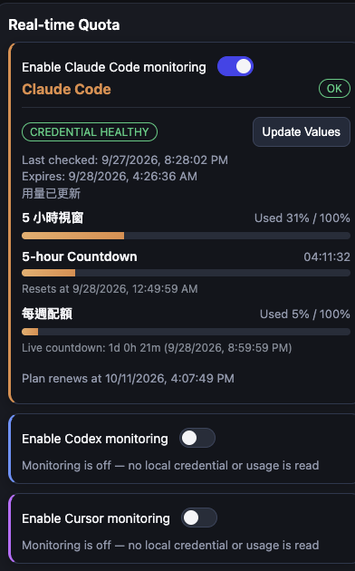
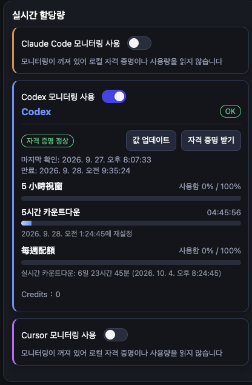
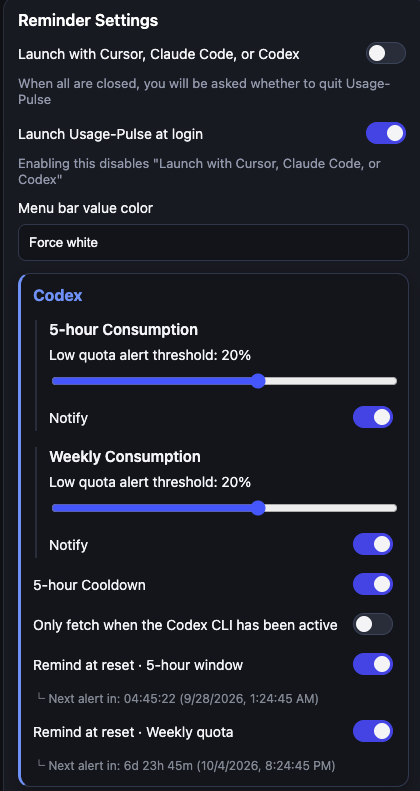
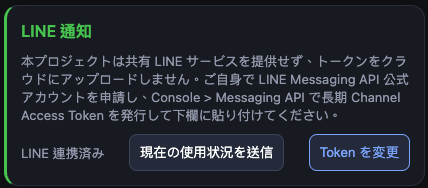
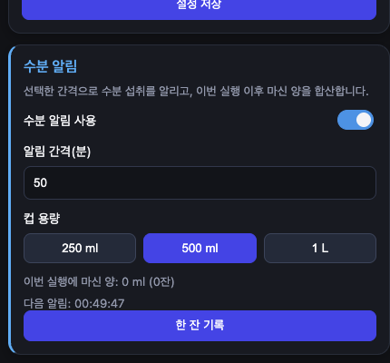

# Usage-Pulse

[English](README.md) | **繁體中文** | [日本語](README.ja.md) | [한국어](README.ko.md)

[](LICENSE)

Usage-Pulse 是跨平台桌面選單列工具，監控 Cursor、Claude Code 與 Codex 配額，在配額變化、額度偏低、或重置時發送通知。

它只讀取你本機已登入的憑證與官方用量資料，不會寫回任何 IDE 的憑證或設定檔。

## 畫面截圖

<table>
  <tr>
    <td><br/><sub>可隨時切換 App 內顯示語言</sub></td>
    <td><br/><sub>Cursor、Claude Code、Codex 的即時配額</sub></td>
  </tr>
  <tr>
    <td><br/><sub>同一畫面切換成韓文顯示</sub></td>
    <td><br/><sub>依服務個別調整提醒設定</sub></td>
  </tr>
  <tr>
    <td><br/><sub>選用的 LINE 通知</sub></td>
    <td><br/><sub>附加功能：喝水提醒</sub></td>
  </tr>
</table>

## 安裝指引

### 下載

請至 [Releases 頁面](https://github.com/xiaochen26wyl/Usage-Pulse/releases) 取得最新版本：

- Apple Silicon（M1/M2/M3...）：`Usage-Pulse-<version>-arm64.dmg`
- Intel Mac：`Usage-Pulse-<version>.dmg`（或 x64 標示檔）
- Windows x64：`Usage-Pulse.Setup.<version>.exe`

### 從原始碼執行

Usage-Pulse 是開源專案——你可以把 repo clone 下來，自己讀過程式碼，再直接執行。

記得點本 repo 上方的 **Watch**（不只是 Star），這樣每次發佈新版本 GitHub 都會通知你：


需要 [Node.js](https://nodejs.org/) 24 與 pnpm 9.15.9（先執行一次 `corepack enable`，pnpm 就會自動使用正確版本）。

```bash
git clone https://github.com/xiaochen26wyl/Usage-Pulse.git
cd Usage-Pulse
pnpm install
pnpm dev
```

`pnpm dev` 會以開發模式啟動，選單列圖示與安裝版相同；下方**首次使用前**列出的登入前置條件同樣適用。

Clone 下來後預設就會追蹤 `main` 分支。由於每次 release 都是從 `main` 打 tag 發佈，之後想更新到新版時，記得先 `git pull` 再重新建置執行。

### 未簽章安裝提示

- macOS Gatekeeper：第一次打開時，於 Finder 對 App 右鍵 -> `打開` -> 再按一次 `打開`。
- Windows SmartScreen：若出現保護提示，選 `其他資訊` -> `仍要執行`。

### 首次使用前

- 先登入 **Cursor Desktop**（供 Cursor 配額讀取）。
- 先安裝**獨立版 Claude Code CLI** 並登入。
- 先登入 **Codex CLI** 或 **Codex Desktop**（Usage-Pulse 不會開啟 Codex 登入介面）。
- 出現提示時請允許系統通知權限。

> Usage-Pulse 不會讀取 Claude Desktop App 內部（加密）的登入狀態。就算你平常只用 Claude Desktop，仍然需要一組透過官方 CLI 完成的 Claude Code 登入。

### Claude Code 憑證設定

在 Usage-Pulse 按「更新數值」偵測憑證並抓取用量。只要 Claude 卡片沒有數值可顯示，就會當場展開一個區塊，裡面有要執行的登入指令，以及一個可以直接貼上 token 的欄位。

貼上的 token 會先實際查一次你的用量再決定是否保留：查不到就不會存起來，並且會告訴你原因。

> 為什麼數字看起來跟 Claude Desktop 自己的「Plan usage limits」面板不一樣：Usage-Pulse 顯示的是**剩餘**配額，Claude Desktop 面板顯示的是**已使用**配額。「剩餘 44%」跟「已使用 56%」是同一個狀態，不是資料錯誤。

## 功能行為

1. 背景會定期檢查 Cursor / Claude Code / Codex 配額，並在變化時提醒你。
2. 低額度與配額重置提醒都可以在設定中依服務、依視窗個別開關。
3. 兩種通知管道，可在設定中個別開關：App 彈窗提醒（免權限、一定生效——顯示於右上角、30 秒後自動關閉）與 LINE 通知（需要 Channel Access Token）。
4. 支援繁體中文、英文、日文、韓文介面，可在 App 語言選單切換。
5. 可隨時從 UI 或選單列離開；若 LINE 開啟，離開時會用最後一次快取用量送出現況。

## 安全性說明

- 讀取項目皆為唯讀：Cursor 本機工作階段資料、官方 Claude Code CLI 已存的登入資訊、Codex 本機憑證檔。
- Usage-Pulse 不會寫入或修改這些檔案或憑證。
- 一般設定（通知開關、語言等）只存在本機，沒有雲端同步。

如果有任何行為看起來不正確——例如數值異常、理應不會觸發的通知，或其他任何預期外的狀況——請不要自行推測，並請至 [Discussions Q&A](https://github.com/xiaochen26wyl/Usage-Pulse/discussions/categories/q-a-%E8%A7%A3%E6%B1%BA%E5%95%8F%E9%A1%8C) 提出問題。

## 授權與重要聲明

Usage-Pulse 採用 **MIT 風格授權，預設僅限非商業使用**（完整條文見 [`LICENSE`](LICENSE)）。**個人使用與公司內部使用皆完全免費。** 因為是免費提供給公司使用，請公司在採用前自行評估資安風險。

**請只從本 repo 官方的 GitHub Releases 頁面下載 Usage-Pulse。** 任何其他來源的安裝檔都不是原開發者發佈的版本，無法保證它如何處理你的憑證。

## 支援

如果 Usage-Pulse 對你有幫助，歡迎到 GitHub 幫專案點一顆 ⭐——這是免費、快速，而且對我非常有幫助。你也可以透過 [GitHub Sponsors](https://github.com/sponsors/xiaochen26wyl) 贊助支持。

## 追蹤開發者

- Instagram（English）：[@xiaochen26wyl](https://www.instagram.com/xiaochen26wyl/)
- Threads（中文）：[@xiaochen26wyl](https://www.threads.com/@xiaochen26wyl)

W.Y. LI — [LinkedIn](https://www.linkedin.com/in/wenyu-li-1a9868bb/)（商業授權與買斷）
